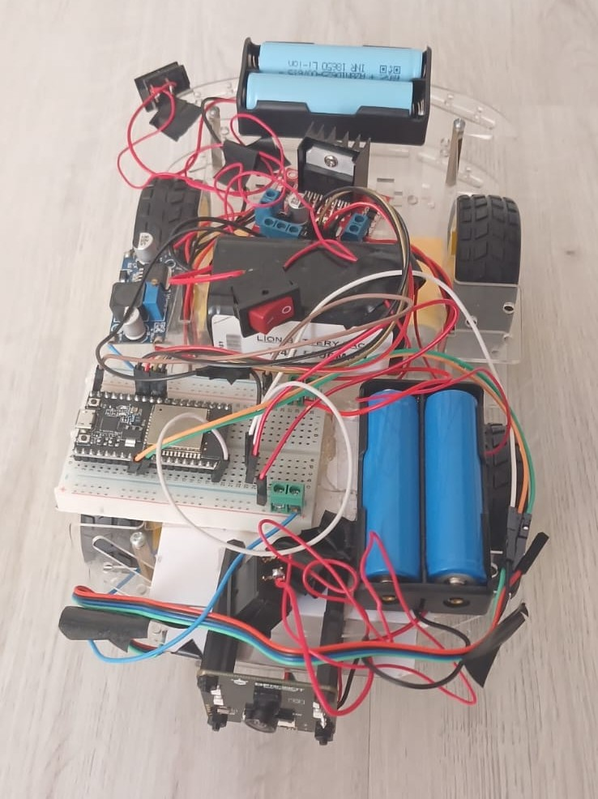
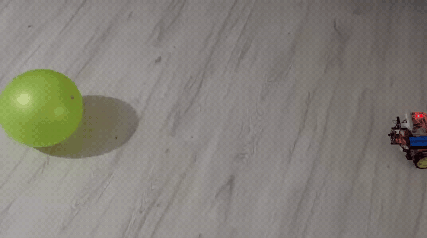
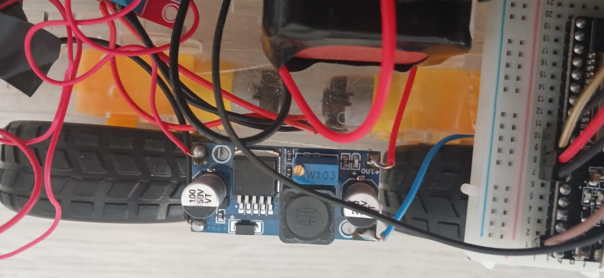
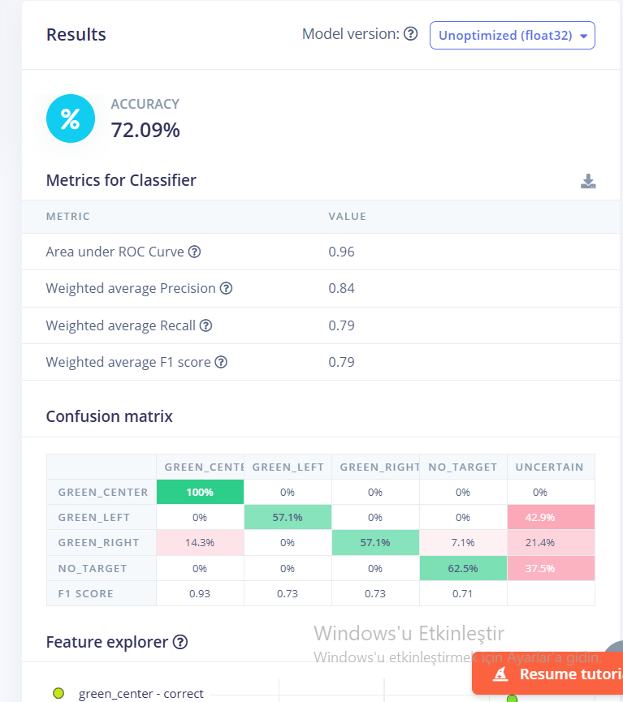
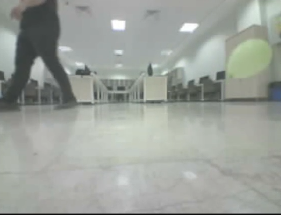
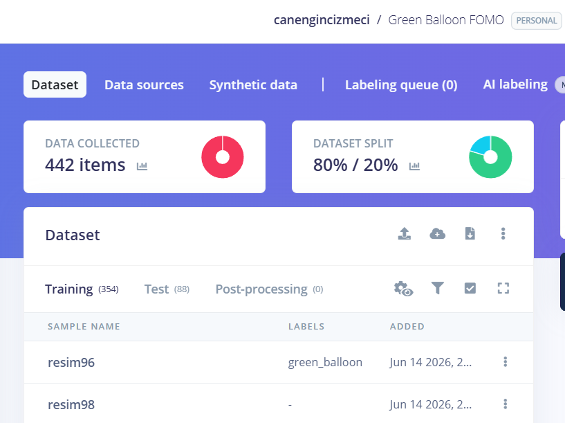
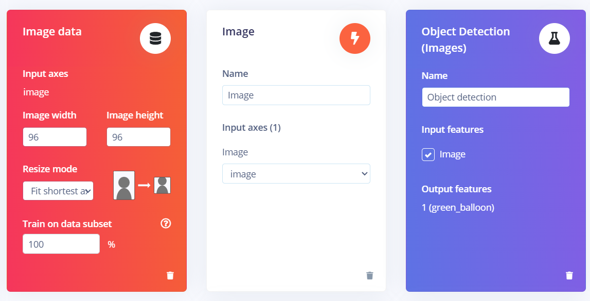
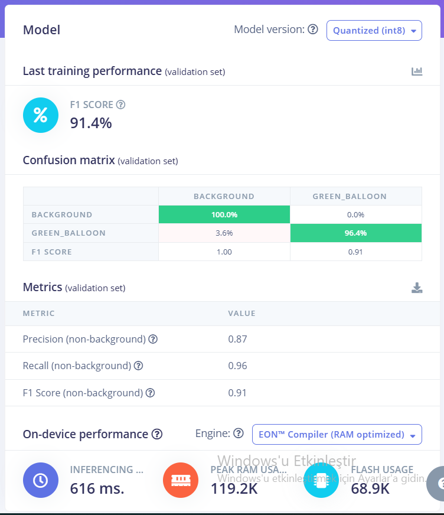
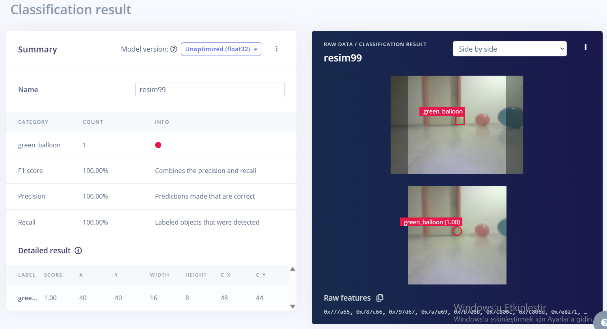

# Edge AI Autonomous Robot

> An autonomous mobile robot that detects and tracks a moving target using real-time, on-device AI inference on an ESP32-S3.


<p align="center">
  
</p>

An embedded Edge AI system designed to detect and autonomously follow a moving target without relying on a cloud server or external computer.

The system runs a **FOMO (Faster Objects, More Objects)** object detection model directly on an **ESP32-S3 AI Camera**. The detected object's position is converted into autonomous movement decisions and transmitted via **UART** to an **ESP32-WROOM**, which controls the robot's motors through an **L298N motor driver**.


## Real-World Test

<p align="center">
  
</p>

The robot detects the target entirely on-device and autonomously adjusts its movement according to the target's position in the camera frame.

## Overview

This project is a fully embedded autonomous mobile robot that combines computer vision, Edge AI, and real-time motor control.

A custom object detection model was trained using Edge Impulse and deployed directly to an ESP32-S3 AI Camera. The model detects a target in the camera frame and determines its relative position.

Based on the detection result, the ESP32-S3 generates movement commands such as **LEFT**, **RIGHT**, **FORWARD**, and **STOP**. These commands are transmitted via UART to a separate ESP32-WROOM responsible for motor control.

The entire perception-to-action pipeline runs locally on the robot without requiring a cloud service or external computer.

## System Architecture

The system is divided into two embedded controllers with separate responsibilities:

- **ESP32-S3 AI Camera — Perception & Decision**
  - Captures camera frames
  - Runs the FOMO object detection model on-device
  - Determines the target's position in the frame
  - Generates autonomous movement commands

- **ESP32-WROOM — Motion Control**
  - Receives movement commands from the ESP32-S3 via UART
  - Controls the L298N motor driver
  - Drives the DC motors according to the received command

### Data Flow


Camera<br>
↓<br>
ESP32-S3 AI Camera<br>
↓<br>
FOMO Object Detection<br>
↓<br>
Target Position<br>
↓<br>
Movement Decision<br>
↓<br>
UART<br>
↓<br>
ESP32-WROOM<br>
↓<br>
L298N Motor Driver<br>
↓<br>
DC Motors

## How It Works

1. The ESP32-S3 AI Camera continuously captures images from the environment.

2. Each frame is processed by the on-device FOMO object detection model.

3. When the target is detected, its position in the camera frame is analyzed.

4. The ESP32-S3 converts the target position into a movement decision:
   - **LEFT** — target is located on the left side of the frame
   - **RIGHT** — target is located on the right side of the frame
   - **FORWARD** — target is positioned near the center
   - **STOP** — no valid movement condition is detected

5. The movement command is transmitted to the ESP32-WROOM via UART.

6. The ESP32-WROOM translates the command into motor control signals and drives the motors through the L298N motor driver.

This creates a complete on-device **perception → decision → action** loop.

## Hardware

The robot is built around a dual-microcontroller architecture that separates AI-based perception from motor control.

| Component | Role |
|---|---|
| **ESP32-S3 AI Camera** | Image capture, FOMO inference, target localization, and movement decision |
| **ESP32-WROOM** | Receives movement commands and handles motor control |
| **L298N Motor Driver** | Drives the DC motors based on signals from the ESP32-WROOM |
| **DC Motors** | Provides robot movement |
| **2× 18650 Batteries** | Main power source |
| **Voltage Regulator** | Provides regulated power to the electronic components |

Separating perception and motion control between two microcontrollers keeps the system modular and allows the ESP32-S3 to focus on the Edge AI workload.

### Power System

The robot is powered by two 18650 lithium-ion cells. The battery pack provides approximately **8 V**, depending on the state of charge.

A DC-DC buck converter is used to step down and regulate the battery voltage to approximately **5 V** for the low-voltage electronics.

<p align="center">
  
</p>

This power architecture allows the robot to operate from a self-contained battery supply while providing a regulated voltage for the embedded control electronics.

## Edge AI Model
 
The object detection model was developed and trained using **Edge Impulse** and deployed directly to the ESP32-S3 AI Camera for fully on-device inference.

### Initial Approach — Image Classification

The first version of the vision system used an image classification model instead of object detection.

The camera frame was divided conceptually into directional classes, and the model classified each image into one of four states:

- `green_left`
- `green_center`
- `green_right`
- `no_target`

These classes were directly mapped to robot movement decisions.

<p align="center">
  
</p>

The classification model achieved **72.09% accuracy** on the test set, with a weighted precision of **0.84**, recall of **0.79**, and F1 score of **0.79**.

<p align="center">
  
</p>

Although the classification approach was functional, real-world robot testing exposed an important hardware-control limitation.

The DC motors required a minimum drive level to move the robot reliably. Below this level, the robot could not consistently overcome the mechanical load; above it, the robot moved relatively quickly. This made fine low-speed control difficult with the available motor and drivetrain configuration.

As a result, the robot could travel too far between perception and movement updates, reducing tracking stability.

Instead of treating this purely as a model-accuracy problem, the perception strategy was redesigned around **FOMO object detection**. The final system directly estimates the target's position in the image and uses that spatial information to generate movement decisions.

This iteration illustrates how the final architecture was shaped by the interaction between **AI inference, embedded hardware, and physical motion constraints**.

### Dataset

A custom image dataset was collected specifically for this project using images of the target under different positions, distances, backgrounds, and real-world operating conditions.

<p align="center">
  
</p>

Training data was collected from the robot's operating environment and camera perspective so that the model could learn from conditions closer to those encountered during physical testing.

Early versions of the dataset were not sufficiently diverse for reliable real-world detection. Additional target samples and **negative images** containing no target object were therefore collected to reduce false detections and improve generalization.

The final dataset contained **442 images**, split into **354 training** and **88 testing** samples.

<p align="center">
  
</p>


### Model

The project uses **FOMO (Faster Objects, More Objects)**, an object detection architecture designed for resource-constrained embedded devices.

The input images are resized to **96 × 96 pixels**, allowing the model to operate within the memory and computational limitations of the ESP32-S3 while still providing sufficient information for target localization.

<p align="center">
  
</p>

### On-Device Inference

The trained model runs entirely on the ESP32-S3:

- No cloud inference
- No external computer
- No remote AI API
- Detection results are processed directly by the robot

This allows the complete vision pipeline to operate locally on the embedded hardware.

### Model Performance

The model was evaluated separately on the validation set and on the held-out test set.

#### Validation Performance — Quantized INT8

<p align="center">
  
</p>

| Metric | Result |
|---|---:|
| **F1 Score** | **91.4%** |
| **Precision** | **0.87** |
| **Recall** | **0.96** |
| **Inference Time** | **616 ms** |
| **Peak RAM Usage** | **119.2 KB** |
| **Flash Usage** | **68.9 KB** |

The quantized INT8 model achieved an F1 score of 91.4% on the validation set while remaining small enough to run directly on the ESP32-S3.

#### Held-Out Test Performance

The model was also evaluated on the separate test split that was not used for training.

| Metric | Result |
|---|---:|
| **Precision** | **0.81** |
| **Recall** | **0.87** |
| **F1 Score** | **0.84** |

A correctly detected test sample is shown below:

<p align="center">
  
</p>

In this example, the model correctly detected the `green_balloon` target with a confidence score of **1.00**.

## Firmware Architecture

The firmware is divided into two independent applications, reflecting the separation between perception and motion control.

### ESP32-S3 AI Camera — Vision Controller

**File:** `firmware/esp32-s3-ai-camera/vision_controller.ino`

The ESP32-S3 acts as the high-level perception and decision controller.

Its main responsibilities are:

- Capturing frames from the onboard camera
- Running the Edge Impulse FOMO model
- Processing detected target coordinates
- Determining the target's relative position
- Converting detection results into movement commands
- Sending commands to the ESP32-WROOM through UART

This controller contains the complete **camera → inference → decision** pipeline.

### ESP32-WROOM — Motor Controller

**File:** `firmware/esp32-wroom-motor-controller/motor_controller.ino`

The ESP32-WROOM is responsible for the low-level motion layer.

Its main responsibilities are:

- Receiving movement commands through UART
- Interpreting the received command
- Controlling the L298N motor driver
- Executing forward, left, right, and stop behaviors

This separation prevents motor-control responsibilities from being mixed with the computationally heavier vision pipeline.

### Controller Communication

The two controllers communicate using UART:

```text
ESP32-S3                           ESP32-WROOM
─────────                          ────────────
Camera
   ↓
FOMO Inference
   ↓
Decision
   ↓
UART Command  ──────────────────► Command Parser
                                      ↓
                                 Motor Control
                                      ↓
                                     L298N
                                      ↓
                                   DC Motors
```


## Results

The final prototype successfully demonstrated a complete autonomous Edge AI pipeline running on embedded hardware.

The system was able to:

- Detect the target using a FOMO model running directly on the ESP32-S3
- Determine the target's relative position in the camera frame
- Convert detections into autonomous movement decisions
- Transmit movement commands between two microcontrollers via UART
- Control the physical robot through the ESP32-WROOM and L298N motor driver
- Track and move toward the target without cloud inference or an external computer

The project demonstrates an end-to-end embedded AI workflow:

**custom dataset → model training → model optimization → on-device inference → autonomous decision → physical action**

Real-world testing also exposed limitations related to inference latency, motor speed, and tracking stability. These constraints provide clear directions for future optimization rather than being hidden by simulation-only testing.

## Challenges & Engineering Decisions

Building the system required solving several practical constraints that appeared only after deploying the model to real embedded hardware.

### From Classification to Object Detection

The initial system used image classification with four directional classes: `green_left`, `green_center`, `green_right`, and `no_target`.

This approach estimated the target's direction indirectly by assigning the entire camera frame to a predefined class. While functional, it provided only coarse directional information and was sensitive to changes in the target's position within the frame.

Real-world testing also revealed a system-level limitation: the available DC motors could not provide sufficiently fine low-speed control. Below a certain drive level the robot could not move reliably, while above it the robot moved relatively quickly compared with the perception update rate.

The vision pipeline was therefore redesigned around **FOMO object detection**, allowing the system to obtain the target's spatial position directly from each frame and make movement decisions from detected coordinates.

This transition changed the system from coarse frame-level classification to spatially aware object detection and produced a more suitable perception architecture for autonomous tracking.

### Memory Constraints

Running the object detection model on the ESP32-S3 introduced Tensor Arena memory limitations. The model configuration and input size were optimized to fit within the available embedded memory while preserving usable detection performance.

A **96 × 96** input resolution was selected as a compromise between computational cost, memory usage, and target localization capability.

### Dataset Improvement

Early versions of the model did not generalize reliably to different scenes and backgrounds.

The dataset was therefore expanded with additional target images and **negative samples** containing no target object. This reduced false detections and improved the robustness of the model.

### Edge Impulse / ESP32 Compatibility

During deployment, compatibility issues between the Edge Impulse generated library and the ESP32 Arduino Core had to be resolved before inference could run reliably on the ESP32-S3.

After resolving the integration and memory issues, the complete inference pipeline was successfully executed directly on the microcontroller.

### Inference Latency vs. Robot Speed

One of the main physical limitations was the relationship between model inference latency and motor speed.

The final INT8 model required approximately **616 ms per inference**. At higher motor speeds, the robot could move significantly between consecutive detections, making accurate target tracking more difficult.

This highlighted an important system-level trade-off:

**faster movement → less time for visual correction → reduced tracking stability**

The robot was therefore tested with movement behavior adapted to the available inference rate.

### Dual-Microcontroller Architecture

Instead of combining AI inference and motor control on a single controller, the system separates these responsibilities:

- **ESP32-S3:** vision, inference, target localization, and decision making
- **ESP32-WROOM:** deterministic motor control

The controllers communicate through UART, keeping the perception and motion-control layers modular.

## Repository Structure

```text
edge-ai-autonomous-robot/
│
├── firmware/
│   ├── esp32-s3-ai-camera/
│   │   └── vision_controller.ino
│   │
│   └── esp32-wroom-motor-controller/
│       └── motor_controller.ino
│
├── docs/
│   ├── images/
│   │   ├── robot-overview.jpg
│   │   ├── power-regulator.jpg
│   │   ├── data-collection-example.png
│   │   ├── classification-impulse.png
│   │   ├── classification-performance.png
│   │   ├── dataset-overview.png
│   │   ├── impulse-design.png
│   │   ├── model-performance.png
│   │   ├── detection-example.png
│   │   └── feature-explore.png
│   │
│   └── media/
│       └── robot-tracking-demo.gif
│
└── README.md
```

## Future Improvements

Several improvements could further increase the performance and robustness of the system:

- Reduce inference latency to enable faster and smoother target tracking
- Improve the dataset with more diverse backgrounds, lighting conditions, distances, and target positions
- Evaluate alternative lightweight object detection models for better speed/accuracy trade-offs
- Improve motion control with more gradual steering and speed adjustment
- Add distance estimation to improve approach and stopping behavior
- Improve the mechanical design and camera positioning for more stable visual tracking
- Extend the system to support multiple target classes
- Evaluate more powerful Edge AI hardware for higher frame rates and more complex models

## Author

**Can Engin Çizmeci**  
Computer Engineering Student

Interested in **Backend Engineering, AI Engineering, Edge AI, and Computer Vision**.

This project was developed as a hands-on exploration of deploying computer vision models on resource-constrained embedded hardware and connecting AI inference to real-world autonomous control.
